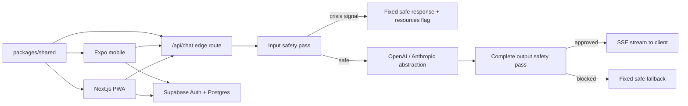

# MindPulse

MindPulse is a calm, private wellbeing companion for teenagers ages 13–18, built by Northlight. It includes an installable responsive web app, an Expo mobile app, a shared bilingual safety/validation package, and a Supabase backend with row-level security.

It is deliberately **not** therapy, medical care, diagnosis, or a crisis service. Read [SAFETY.md](./SAFETY.md) before changing the chat or crisis flow.

## What is included

- Four-step onboarding with age eligibility, plain-language consent, and optional goals
- English and Russian UI from a single shared translation source
- AI companion through one server-side, rate-limited, safety-wrapped streaming route
- Private mood check-ins, journaling, gentle trend insights, and data export/deletion
- Four complete guided practices: box breathing, 5–4–3–2–1 grounding, thought reframe, and body scan
- Region-aware resources hub with an explicit verification gate for hotline data
- PWA shell, dark mode, reduced-motion support, keyboard focus, semantic labels, and responsive navigation
- Expo Router mobile app using the same types, exercises, safety engine, and `/api/chat` endpoint
- Supabase schema, indexes, RLS policies, deletion RPC, local seed account, tests, and CI
- A visible `/style` design-system reference and `AUDIT.md` quality report

## MindPulse v2

The v2 quality pass hardens the companion with provider auto-selection, a safe server-side development fallback, timeouts, structured rate-limit/provider errors, retry, starter prompts, bounded conversation history, safe markdown, and optional recent-mood context. Crisis input still bypasses every provider and model output is still fully screened before delivery.

### Flagship feature: adaptive exercise suggestion

After a mood check-in, MindPulse recommends one of the complete guided exercises with a short, non-clinical reason. The mapping is deterministic and shared across clients: it never diagnoses, labels, or sends mood data to an AI. A rough moment favors grounding, a low moment favors a body scan, and steadier moments offer breathing or reflection. Suggestions update from real check-in data and remain completely dismissible.

## Architecture



The provider response is intentionally buffered before client streaming. That lets MindPulse inspect the _entire_ model output before any partial text reaches a minor. The route then streams only approved text over server-sent events.

## Repository

```text
apps/
  web/       Next.js App Router PWA and server-side chat route
  mobile/    Expo Router / React Native app
packages/
  shared/    types, Zod schemas, i18n, exercises, safety, AI abstraction
supabase/
  migrations/  schema and RLS
  seed.sql     local-only demo account and realistic data
```

## Local setup

Requirements: Node 22+, npm 10+, and optionally Docker plus the Supabase CLI for the full backend.

1. Install dependencies from the repository root:

   ```bash
   npm install
   ```

2. Copy `.env.example` to `apps/web/.env.local`. Local development works immediately with the safe demo companion. Add a server-side provider key for live AI:

   ```dotenv
   AI_PROVIDER=auto
   OPENAI_API_KEY=your_server_only_key
   OPENAI_MODEL=gpt-4o-mini
   AI_MAX_TOKENS=500
   ```

   `auto` chooses OpenAI or Anthropic when its key exists. Without a key it uses the safe local companion only outside production. Set `AI_PROVIDER=mock` for an explicit demo. Production requires a provider key unless `ENABLE_DEMO_AI=true` is deliberately set.

3. Start the web app:

   ```bash
   npm run dev:web
   ```

   Open `http://localhost:3000`. Without Supabase variables, MindPulse uses transparent demo mode and keeps journal/mood/chat data in that browser only.

4. Start mobile in a second terminal:

   ```bash
   copy apps/mobile/.env.example apps/mobile/.env
   npm run dev:mobile
   ```

   On a physical phone, replace `http://localhost:3000` with the web server's LAN address. In production, use the deployed HTTPS Vercel URL.

## Supabase

Start and reset the local project:

```bash
npx supabase start
npx supabase db reset
```

Then copy the local API URL and anon key printed by the CLI into:

```dotenv
NEXT_PUBLIC_SUPABASE_URL=http://127.0.0.1:54321
NEXT_PUBLIC_SUPABASE_ANON_KEY=your_local_anon_key
EXPO_PUBLIC_SUPABASE_URL=http://127.0.0.1:54321
EXPO_PUBLIC_SUPABASE_ANON_KEY=your_local_anon_key
```

Local-only seeded account:

- Email: `demo@mindpulse.local`
- Password: `MindPulseDemo!2026`

Do not run `supabase/seed.sql` in production. Production accounts should be created through Supabase Auth. Every private table has RLS enabled and owner-scoped select/insert/update/delete policies. The browser never receives a service-role key.

The current polished product preview uses local-first demo storage so it remains explorable before Supabase is configured. Authentication and the deletion RPC are wired. The schema is the source of truth for cloud persistence; the next production hardening step is to replace the local repository adapter with TanStack Query mutations against these tables (see “Production launch gates”).

## AI configuration

Only `apps/web/app/api/chat/route.ts` talks to model providers. Web and mobile call MindPulse's own endpoint.

| Variable                   | Location             | Purpose                                              |
| -------------------------- | -------------------- | ---------------------------------------------------- |
| `AI_PROVIDER`              | server only          | `auto`, `openai`, `anthropic`, or `mock`             |
| `OPENAI_API_KEY`           | server only          | OpenAI credential                                    |
| `OPENAI_MODEL`             | server only          | defaults to `gpt-4o-mini`                            |
| `ANTHROPIC_API_KEY`        | server only          | Anthropic credential                                 |
| `ANTHROPIC_MODEL`          | server only          | Anthropic model identifier                           |
| `AI_MAX_TOKENS`            | server only          | capped in code at 700                                |
| `AI_TIMEOUT_MS`            | server only          | provider timeout, clamped to 5–25 seconds            |
| `ENABLE_DEMO_AI`           | server only          | explicit production opt-in for server demo fallback  |
| `ALLOWED_ORIGINS`          | server only          | permitted browser/mobile origins                     |
| `EXPO_PUBLIC_API_BASE_URL` | mobile public config | deployed MindPulse backend URL, never a provider URL |

To swap providers, set `AI_PROVIDER=anthropic`, add `ANTHROPIC_API_KEY`, and redeploy. Clients do not change.

The in-memory edge limiter permits eight chat requests per pseudonymous user/IP bucket per ten minutes. This is a useful MVP spend guard, but serverless instances do not share memory. Before a broad launch, replace it with a shared store such as Vercel KV/Upstash and require an authenticated user ID.

At 500 output tokens, approximate cost equals the selected model's current input price × prompt tokens plus output price × generated tokens. Prices change; check the provider's official pricing page before launch and add account-level budget alerts. No cost estimate is hardcoded here for that reason.

## Scripts

```bash
npm run dev              # web development server
npm run dev:mobile       # Expo development server
npm test                 # shared safety/schema + web component tests
npm run typecheck        # all workspaces
npm run lint             # all workspaces
npm run build            # shared package and production web build
npm run format:check     # formatting check used by CI
```

The safety suite includes English/Russian crisis language, common false positives, abuse signals, disallowed diagnostic output, and validation limits. Add regression cases before changing a safety expression.

## Deploy to Vercel

1. Push the repository to GitHub and import it into Vercel.
2. Keep the repository root as the Vercel root; `vercel.json` installs the workspace and builds `@mindpulse/web`.
3. Add `AI_PROVIDER`, the matching provider key/model, `AI_MAX_TOKENS`, `NEXT_PUBLIC_SUPABASE_URL`, `NEXT_PUBLIC_SUPABASE_ANON_KEY`, and `ALLOWED_ORIGINS` in **Project → Settings → Environment Variables**.
4. Deploy. The Next.js app and `/api/chat` route ship together.
5. Set `EXPO_PUBLIC_API_BASE_URL=https://your-project.vercel.app` before creating Expo builds.
6. Test crisis routing, CORS, rate limiting, data deletion, both languages, and a screen reader against the deployed build.

Vercel Hobby is suitable for a personal MVP/portfolio demonstration. Its terms and limits can change, and Hobby is not intended for a commercial production venture. Move to an appropriate paid plan before operating MindPulse commercially.

## PWA

The web app publishes a manifest and a conservative offline shell. The service worker caches navigation/static assets but deliberately excludes `/api/*`; AI answers are never invented from a stale cache. Install from the browser's “Add to Home Screen” action.

## Production launch gates

1. Human safety/legal review of `SAFETY.md`, prompts, both languages, consent, and minor-data obligations in every launch country.
2. Verify every regional emergency/helpline entry against the authoritative source; no `verification_required` resource may ship as a phone number.
3. Complete the Supabase repository adapter for all web/mobile CRUD and add offline conflict handling. Demo-mode local storage must be clearly disabled for authenticated production users.
4. Replace the instance-local limiter with distributed, authenticated rate limiting and add abuse monitoring that never records raw wellbeing content.
5. Add a privileged server endpoint for reliable account deletion, delivery receipts for export, audit tests for RLS, and retention controls.
6. Conduct professional threat modeling, accessibility testing with teen participants, penetration testing, and incident-response exercises.
7. Complete a coordinated Expo/React Native major upgrade and re-audit dependencies. The 2026-06-22 audit has no high or critical findings, but reports 21 moderate transitive advisories concentrated in the Expo/React Native toolchain; npm's fixes require major-version changes and must be tested together.

## Beyond MVP, in order

1. Production Supabase sync and offline mutation queue
2. Clinician-reviewed, country-specific resource operations workflow
3. Opt-in, non-guilt-inducing reminders with quiet hours
4. Optional exercise audio with transcripts and no auto-play
5. Mood-to-exercise suggestions that are transparent, dismissible, and never clinical
6. Gratitude log and exportable personal summaries

MindPulse is built to be useful without becoming demanding. There are no streaks, engagement loops, infinite feeds, or manipulative notifications.
