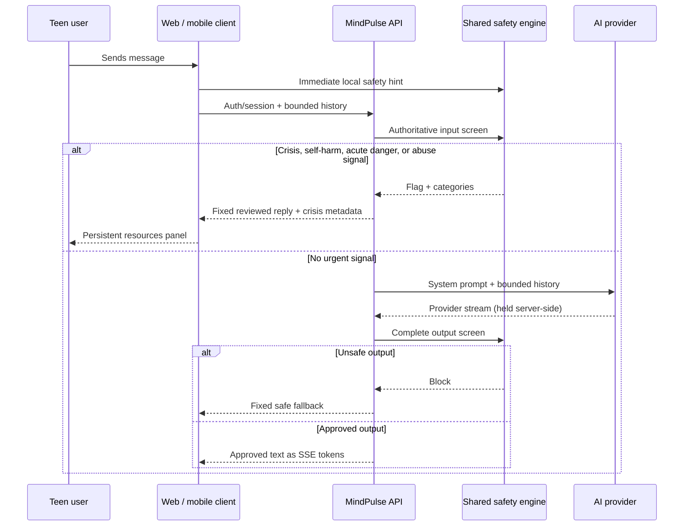

# MindPulse safety design

This document is a launch-critical part of the product. MindPulse supports everyday mental wellbeing for ages 13–18; it is not medical care, therapy, diagnosis, monitoring, or an emergency/crisis service.

## Safety invariants

1. A model is never called before the user's newest text is screened.
2. A crisis or abuse signal never receives improvised model advice.
3. No generated text reaches the user before the complete answer passes output screening.
4. Crisis UI remains visible and does not offer points, streaks, dismissal rewards, or an artificial “resolved” state.
5. Provider credentials stay server-side. Raw wellbeing content is not written to application logs.
6. Every private database record is owner-isolated by row-level security.

## Turn flow

The local client check exists only to surface urgent UI quickly. The server check is authoritative and cannot be bypassed by modifying the client.

## Detection model

`packages/shared/src/safety/index.ts` uses explicit, reviewable English and Russian signals for:

- suicidal ideation and intent;
- self-harm intent;
- immediate danger from another person;
- abuse, threats, or unsafe touching disclosures;
- model output that diagnoses, prescribes, enables harm, sexualizes the relationship, or isolates the teen from trusted adults.

Known idioms such as “kill time” are removed before matching. Tests cover urgent phrases, abuse, false positives, safe supportive language, and blocked clinical claims.

Regex/rule detection is intentionally explainable but cannot understand every spelling, euphemism, language, context, or emerging phrase. It can miss real crises and can over-trigger. It must be supplemented by regularly evaluated classifiers and professional review before a public launch; a classifier must never weaken the deterministic high-confidence path.

## Crisis response

On any matched urgent/abuse signal:

1. Do not call the model.
2. Return `SAFE_CRISIS_REPLY[locale]`, which validates disclosure without promising safety or acting as a counselor.
3. Send crisis metadata to display the persistent resources panel.
4. Encourage moving near a safe person, contacting a trusted adult, and using current local emergency/support resources.
5. Never mark the crisis “complete,” start a countdown, congratulate, award a badge, or hide the panel automatically.

MindPulse does not claim to contact emergency services, track location, notify a parent, or monitor whether help was reached.

## Resource governance

Resources are centralized in `packages/shared/src/safety/resources.ts`. Every entry includes regions, localized copy, URL, availability text, verification status, authoritative source, and last-check date.

The Kazakhstan government resource intentionally has `phone: null` and `verification_required`. A missing number is safer than a plausible but stale number. Before launch, a named human owner must:

1. verify phone/chat availability with the linked Kazakhstan government authority;
2. verify that the service is appropriate and accessible to minors;
3. record the exact source and date;
4. test the displayed link/number from the target region;
5. set a recurring re-verification schedule and removal SLA.

The international fallback links to Find a Helpline's country directory. A directory is not a guarantee of availability; users are still told to contact local emergency services when danger is immediate.

## AI guardrails

`MINDPULSE_SYSTEM_PROMPT` requires short, age-appropriate, validating replies and forbids:

- diagnosis, prescription, or clinical certainty;
- romantic/sexual engagement;
- instructions or encouragement for harm;
- shame, fear, coercion, or promises;
- secrecy, exclusivity, dependence, or isolation from trusted people;
- engagement-maximizing behavior.

History is limited to 12 bounded messages, user input to 4,000 characters, and model output to at most 700 tokens. Only the server owns provider selection and credentials.

## Privacy and data controls

- Browser demo mode stores data locally and labels that behavior.
- Authenticated production records belong to the user ID from Supabase Auth.
- RLS is enabled on profiles, moods, journals, chat sessions/messages, and exercise completions.
- Policies scope reads and writes to `auth.uid()`; chat-message inserts also verify session ownership.
- Foreign keys cascade deletion from `auth.users`.
- The deletion RPC can act only on the authenticated caller and is not granted to anonymous/public roles.
- Export produces a readable JSON copy. Provider/service-role keys never enter an export.
- The chat route does not log prompts, answers, safety matches, or identities.

Before launch, define retention windows, backup-deletion behavior, lawful-basis/consent handling, guardian requirements by jurisdiction, subject access operations, and incident notification procedures with qualified counsel.

## Abuse disclosure nuance

Abuse signals are treated as safety events even without explicit self-harm language. The response encourages reaching a safe adult/local support without telling the teen to confront an alleged abuser or making a promise of confidentiality. Mandatory-reporting obligations vary by service, staff role, and country; MindPulse must not claim duties or actions it cannot perform.

## Testing and review

Required before each release that changes safety code, prompts, providers, languages, or crisis UI:

- run `npm test` and preserve regression cases;
- manually test English and Russian urgent phrases on web and mobile;
- verify that the model provider is not called on a flagged input;
- inject disallowed model outputs and verify full blocking before token delivery;
- verify crisis UI with keyboard, screen reader, narrow viewport, dark mode, and reduced motion;
- verify rate-limit responses do not dismiss crisis resources;
- verify all resource links and human verification metadata;
- run Supabase RLS tests using two distinct users.

## Known limitations / launch blockers

- Deterministic phrases do not provide comprehensive multilingual crisis understanding.
- The MVP rate limiter is instance-local; a distributed limiter is required at scale.
- Region defaults to Kazakhstan; production must use a consent-respecting explicit region choice, not covert location tracking.
- The provider output safety screen is a focused rule layer, not proof that every response is appropriate.
- MindPulse cannot know whether a user is safe, whether a disclosure is literal, or whether a resource answered.
- Resource freshness requires a staffed operational process.
- Local demo storage is not cross-device and should not be presented as cloud-backed persistence.
- The product requires professional clinical-safety, child-safeguarding, privacy/legal, accessibility, and security review before real-world use by minors.

When uncertain, fail toward human support, transparent limits, and less model improvisation.
