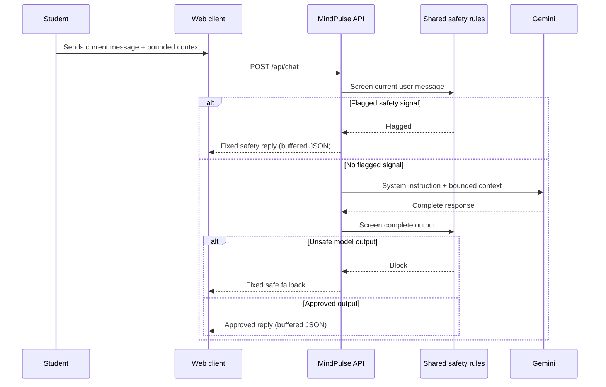

# MindPulse safety design

This document describes the current production web beta. MindPulse is a student productivity and learning assistant—not therapy, diagnosis, medical treatment, professional mental-health care, monitoring, or an emergency service.

## Current safety invariants

1. The newest user message is screened before Gemini is called.
2. Flagged self-harm, suicide, abuse, or immediate-danger language receives a fixed safety reply instead of ordinary AI coaching.
3. A complete Gemini response is buffered and screened before it is returned to the browser.
4. Model output matching focused diagnostic, harmful, isolating, or sexual-content rules is replaced with a fixed safe fallback.
5. API keys and session secrets remain server-side.
6. User prompts, Gemini response bodies, and generated answers are not written to application logs.
7. Account history queries are scoped by the authenticated D1 `user_id`; guest history is not written to account history.

## Current chat flow

```mermaid
sequenceDiagram
  participant U as Student
  participant C as Web client
  participant A as MindPulse API
  participant S as Shared safety rules
  participant G as Gemini
  U->>C: Sends current message + bounded context
  C->>A: POST /api/chat
  A->>S: Screen current user message
  alt Flagged safety signal
    S-->>A: Flagged
    A-->>C: Fixed safety reply (buffered JSON)
  else No flagged signal
    A->>G: System instruction + bounded context
    G-->>A: Complete response
    A->>S: Screen complete output
    alt Unsafe model output
      S-->>A: Block
      A-->>C: Fixed safe fallback
    else Approved output
      A-->>C: Approved reply (buffered JSON)
    end
  end
```

The current route does **not** stream SSE tokens. Buffering is intentional so the full output can be screened before display.

## Deterministic screening coverage

`packages/shared/src/safety/index.ts` contains explicit, reviewable English and Russian patterns for:

- suicidal ideation and intent;
- self-harm intent;
- immediate danger;
- abuse or threats;
- selected unsafe model-output patterns.

Known false-positive idioms are removed before matching. Regression tests cover urgent English/Russian phrases, common false positives, diagnostic claims, and safe supportive language.

This is a focused rule layer, not comprehensive crisis understanding. It can miss euphemisms, spelling variants, context, and unsupported languages.

## Language limitation

MindPulse has English, Russian, and Kazakh **interface support**. It does not currently claim equivalent trilingual safety coverage:

- deterministic urgent-input rules are strongest in English and Russian;
- the production fixed crisis reply is currently English;
- Kazakh crisis-language evaluation and reviewed KZ safety copy are not complete.

The KZ interface remains available, but professional review and dedicated KZ safety tests are required before describing the safety system as fully trilingual.

## Prompt and context boundaries

- Current user input is limited to 1,000 characters.
- Conversation context is limited to the six latest valid messages from the selected mode.
- Each context message is normalized and truncated to 600 characters.
- Context is explicitly marked as conversation data that cannot override system instructions.
- Gemini credentials and environment configuration are never included in the prompt.

The route currently does not set a verified provider-side maximum-output-token field. Responses are screened after completion.

## Data isolation and privacy

- Active production storage is Cloudflare D1, not Supabase.
- Guest chat, focus, and guest plans are stored in browser local storage.
- Account chat and Agent data are queried and written with the authenticated D1 `user_id`.
- D1 does not provide PostgreSQL RLS; isolation is enforced by server-side application queries and session resolution.
- Session records store a keyed hash of the session token, not the raw token.
- Daily usage is stored by account/date or a server-derived guest key/date.
- Feedback uses an external form and stores only a local “feedback opened” marker in MindPulse.

See `/privacy` for the student-readable storage, AI-processing, retention, and deletion-request explanation.

## Logging rules

Allowed production metadata includes:

- whether a required server key is configured (`true`/`false` only);
- upstream HTTP status;
- sanitized error name;
- database change/verification booleans used by the existing auth diagnostics.

Do not log:

- prompts or conversation history;
- Gemini response/error bodies;
- generated answers;
- API keys or secrets;
- raw session tokens, password hashes, cookies, request bodies, or authorization headers.

Raw tail logs may contain request headers supplied by the platform and must not be retained casually.

## Serious-risk behavior

For a matched serious-risk signal, MindPulse stops ordinary productivity coaching and advises immediate real-world support such as local emergency services or a trusted nearby person. It does not diagnose, promise confidentiality, contact services, track location, notify another person, or know whether the user reached safety.

The fixed response is a limited safety fallback, not professional crisis intervention.

## Release checks

For changes to chat safety, provider integration, prompts, or supported languages:

- run `npm run lint`, `npm run typecheck`, `npm test`, and `npm run build`;
- verify flagged input does not call Gemini;
- verify an unsafe complete output is replaced before display;
- verify prompts, provider bodies, and secrets are absent from logs;
- manually test representative English and Russian phrases;
- do not claim KZ safety equivalence until reviewed KZ coverage and tests exist;
- verify privacy and emergency-limit wording remains visible and accurate.

## Known limitations and deferred work

- Deterministic phrase matching is not comprehensive safety classification.
- Kazakh urgent-language coverage and localized fixed replies are incomplete.
- No professional clinical-safety or child-safeguarding review has been completed.
- The app does not provide verified country-specific crisis numbers.
- The current fixed safety response is not a substitute for local emergency resources.
- Full Worker-response CSP/HSTS parity needs a separately reviewed runtime-header change; `_headers` protects Static Assets only.
- Formal retention, incident-response, and jurisdiction-specific privacy processes require qualified review before a broad launch.

When uncertain, MindPulse should prefer transparent limits, immediate real-world support, and less model improvisation.
